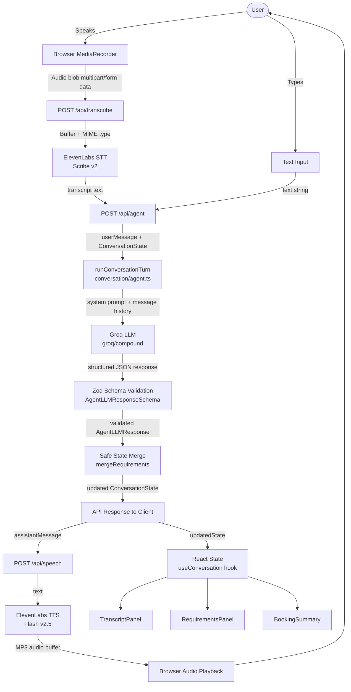

# MoveMate AI — Voice Booking Assistant

A voice-powered booking assistant for a transportation and moving service, built as a technical internship assignment prototype.

---

## Project Overview

MoveMate AI allows users to book a moving or transportation service through a natural conversation — either by speaking or typing. The assistant progressively collects all required booking details (pickup location, drop location, items to move, date, time, and vehicle type) by asking focused follow-up questions, one at a time. It tracks conversation state, detects corrections, identifies missing information, and presents a final summary for confirmation before concluding.

This is a prototype that simulates the booking intake flow. No vehicle is dispatched and no payment is processed.

---

## Key Features

- **Voice input** — Users can speak their request via the browser microphone. The recording is captured using the `MediaRecorder` API and sent to the server for transcription.
- **Speech-to-text** — Audio is transcribed server-side using ElevenLabs Scribe v2 (`scribe_v2`), supporting WebM and MP4 audio formats up to 25 MB.
- **Text input fallback** — A text area is always available for users without a microphone or when voice input is unavailable.
- **LLM-powered conversation** — Each user message is processed by Groq's `groq/compound` model (with `qwen/qwen3.8-27b` as fallback). The LLM receives the full current booking state and conversation history in its context on every turn.
- **Structured JSON extraction** — The LLM is required to return a strictly typed JSON response that is validated with Zod before being applied to the booking state. The system gracefully handles plain-string location responses from the model via schema coercion.
- **Progressive information collection** — The assistant identifies which of the five required fields (pickup, drop, items, date, time) are still missing and asks for them naturally, one at a time.
- **Context-aware follow-up questions** — The LLM is explicitly instructed never to re-ask for information already collected, and its context always includes the current booking state.
- **Correction handling** — When the user corrects a previously provided value (e.g., "Actually, pickup is HSR Layout"), only the corrected field is updated; all other fields are preserved. The LLM response includes `correction_detected` and `corrected_fields` flags.
- **Ambiguity detection** — The LLM can set `needs_clarification: true` with a `clarification_reason` when a user utterance is ambiguous.
- **Relative date resolution** — Dates such as "tomorrow", "tonight", and "next Monday" are resolved relative to the current date/time, which is injected into the system prompt at runtime (using IST timezone).
- **Text-to-speech response** — The assistant's reply is synthesised using ElevenLabs Flash v2.5 (`eleven_flash_v2_5`) and played back automatically in the browser as an MP3 audio stream.
- **Live requirements panel** — A real-time panel shows all six booking fields and their fill status with a progress bar, updating after every assistant turn.
- **Booking summary and confirmation** — Once all required fields are collected, a structured summary card is shown. After the user confirms, the conversation state is set to `confirmed`.
- **Safe state merge** — Each turn merges the LLM's updated requirements with the previous state using a non-destructive merge: existing values are never replaced by nulls.
- **Conversation transcript** — The full back-and-forth conversation is displayed in a scrollable chat panel, auto-scrolling to the latest message.
- **Session reset** — A "Start over" button clears all state and starts a fresh conversation.

---

## How It Works — Conversation Flow

```
User speaks or types a message
        ↓
[Voice path only]
Browser captures audio via MediaRecorder API
        ↓
Audio blob uploaded to POST /api/transcribe
        ↓
ElevenLabs Scribe v2 transcribes audio → transcript text returned
        ↓
[Both paths rejoin here]
Transcript (or typed text) sent to POST /api/agent
along with the full current conversation state (requirements + message history)
        ↓
Server builds system prompt with current booking state + current date/time
        ↓
Groq LLM (groq/compound) processes the message and returns structured JSON:
  - assistant_message   → what to say to the user
  - updated_requirements → all booking fields after this turn
  - missing_requirements → fields still needed
  - status              → collecting | ready_for_confirmation | confirmed
  - correction_detected → whether a field was corrected
        ↓
Response validated against Zod schema
        ↓
State merged (non-destructive: nulls never overwrite existing values)
        ↓
UI updates: transcript panel, requirements panel, booking summary
        ↓
Assistant message text sent to POST /api/speech
        ↓
ElevenLabs Flash v2.5 synthesises speech → MP3 audio returned
        ↓
Audio played back in the browser
        ↓
Cycle repeats until all required fields are collected and user confirms
```

---

## System Architecture



---

## Project Structure

```
movemate-ai/
├── src/
│   ├── app/
│   │   ├── page.tsx                  # Main UI page (single-page app)
│   │   ├── layout.tsx                # Root layout with metadata
│   │   ├── globals.css               # Global styles (Tailwind CSS v4)
│   │   └── api/
│   │       ├── agent/route.ts        # POST /api/agent — LLM conversation turn
│   │       ├── transcribe/route.ts   # POST /api/transcribe — STT via ElevenLabs
│   │       └── speech/route.ts       # POST /api/speech — TTS via ElevenLabs
│   ├── components/
│   │   ├── MicButton.tsx             # Animated microphone button with state indicators
│   │   ├── TranscriptPanel.tsx       # Scrollable chat message history
│   │   ├── RequirementsPanel.tsx     # Live booking fields panel with progress bar
│   │   └── BookingSummary.tsx        # Summary card shown at confirmation stage
│   ├── hooks/
│   │   ├── useConversation.ts        # Orchestrates agent API call + TTS playback
│   │   └── useVoiceRecorder.ts       # MediaRecorder wrapper for browser audio capture
│   └── lib/
│       ├── ai/
│       │   ├── config.ts             # Centralised model IDs and parameters
│       │   ├── groq.ts               # Groq SDK client with model fallback chain
│       │   └── prompts.ts            # System prompt builder with state injection
│       ├── conversation/
│       │   ├── agent.ts              # Conversation orchestrator and state merger
│       │   └── state.ts              # Booking summary formatter
│       ├── schemas/
│       │   ├── requirements.ts       # Zod schemas: Location, MovingItem, BookingRequirements
│       │   └── agent-response.ts     # Zod schemas: AgentLLMResponse, ConversationState
│       └── voice/
│           ├── elevenlabs.ts         # ElevenLabs SDK client singleton
│           ├── stt.ts                # Speech-to-text wrapper (Scribe v2)
│           └── tts.ts                # Text-to-speech wrapper (Flash v2.5)
├── __tests__/
│   └── conversation.test.ts          # 33 unit tests for schemas and state logic
├── .env.example                      # Environment variable template (no secrets)
├── vercel.json                       # Vercel deployment config (bom1 region)
├── next.config.ts                    # Next.js config with security headers
└── package.json
```

---

## API Endpoints

| Method | Endpoint | Description |
|--------|----------|-------------|
| `POST` | `/api/transcribe` | Accepts `multipart/form-data` with an `audio` file. Returns `{ transcript, language }`. Max 25 MB. |
| `POST` | `/api/agent` | Accepts `{ userMessage, conversationState }`. Returns `{ assistantMessage, updatedState, correctionDetected, correctedFields }`. |
| `POST` | `/api/speech` | Accepts `{ text }` (max 1000 chars). Returns raw MP3 audio (`audio/mpeg`). |

All API keys are server-side only and never exposed to the client.

---

## Booking Requirements Collected

| Field | Required | Notes |
|-------|----------|-------|
| Pickup location | ✅ | Area/neighbourhood minimum; full address optional |
| Drop location | ✅ | Area/neighbourhood minimum; full address optional |
| Items to move | ✅ | Array of `{ name, quantity, notes }` |
| Date | ✅ | Natural language resolved relative to current IST date |
| Time | ✅ | Stored as HH:MM or descriptive string |
| Vehicle type | ❌ Optional | `mini_truck`, `tempo`, `large_truck`, `bike`, `suitable` |
| Special requirements | ❌ Optional | Free text, only asked if relevant |

---

## Tech Stack

| Layer | Technology |
|-------|-----------|
| Framework | Next.js 16 (App Router) |
| Language | TypeScript |
| Styling | Tailwind CSS v4 |
| LLM | Groq API (`groq/compound`, fallback: `qwen/qwen3.8-27b`) |
| Speech-to-text | ElevenLabs Scribe v2 |
| Text-to-speech | ElevenLabs Flash v2.5 |
| Schema validation | Zod |
| Audio capture | Browser `MediaRecorder` API |
| Testing | Jest + ts-jest |
| Deployment | Vercel (Mumbai region — `bom1`) |

---

## Environment Variables

Create a `.env.local` file in the project root:

```env
GROQ_API_KEY=          # Groq API key for LLM inference
ELEVENLABS_API_KEY=    # ElevenLabs API key for STT and TTS
ELEVENLABS_VOICE_ID=   # ElevenLabs voice ID (must be accessible on your plan)
```

> **Note:** All three variables are required. The app will return a `500` error if any are missing. They are read server-side only and are never sent to the browser.

### ElevenLabs Voice ID

Free-plan ElevenLabs accounts can only use specific pre-made voices. The following voice IDs are confirmed to work on the free tier:

| Voice | ID |
|-------|----|
| Bella | `EXAVITQu4vr4xnSDxMaL` |
| Antoni | `ErXwobaYiN019PkySvjV` |
| Arnold | `VR6AewLTigWG4xSOukaG` |
| Adam | `pNInz6obpgDQGcFmaJgB` |

---

## Local Development

**Prerequisites:** Node.js 18+, npm

```bash
# 1. Clone the repository
git clone https://github.com/abhinav24x/Movemate-AI.git
cd Movemate-AI

# 2. Install dependencies
npm install

# 3. Set up environment variables
cp .env.example .env.local
# Edit .env.local and fill in your API keys

# 4. Start the development server
npm run dev
```

Open [http://localhost:3000](http://localhost:3000) in your browser.

---

## Running Tests

```bash
npm test
```

33 unit tests covering:
- Zod schema validation for all booking and agent response schemas
- Missing field detection logic
- Readiness-for-confirmation logic
- Location helper functions
- State merge semantics (7 test cases including corrections and context preservation)
- Conversation state schema validation

---

## Deployment (Vercel)

The project is pre-configured for Vercel deployment (`vercel.json`, Mumbai region).

**Via Vercel Dashboard (recommended):**

1. Push this repository to GitHub
2. Go to [vercel.com](https://vercel.com) → **Add New Project** → import your GitHub repo
3. In the **Environment Variables** section, add:
   - `GROQ_API_KEY`
   - `ELEVENLABS_API_KEY`
   - `ELEVENLABS_VOICE_ID`
4. Click **Deploy**

Vercel will automatically run `npm install` and `next build` on each push to the main branch.

**Via CLI:**

```bash
npm install -g vercel
vercel login
vercel deploy --prod
```

---

## Design Decisions

- **Stateless API, stateful client** — The full `ConversationState` (requirements + message history + status) is owned by the React client and sent with every request. This avoids server-side session storage entirely.
- **Zod on both sides** — All API request and response bodies are validated with Zod schemas on the server. The LLM's JSON output is also validated before being applied to state, with a safe fallback if validation fails.
- **Non-destructive state merge** — When the LLM responds with `null` for a field it didn't update, the existing value from the previous state is preserved. This prevents accidental data loss across turns.
- **Model fallback chain** — The Groq client tries four strategies in order: primary model with JSON mode → primary model without JSON mode → fallback model with JSON mode → fallback model without JSON mode. This handles API-level differences across model tiers.
- **TTS is non-fatal** — If text-to-speech fails (e.g., network error), the conversation continues silently. The `useConversation` hook catches TTS errors and resolves rather than throwing.
- **API keys are server-side only** — All three API keys are accessed exclusively in Next.js API route handlers. No key is imported into any `"use client"` module.
